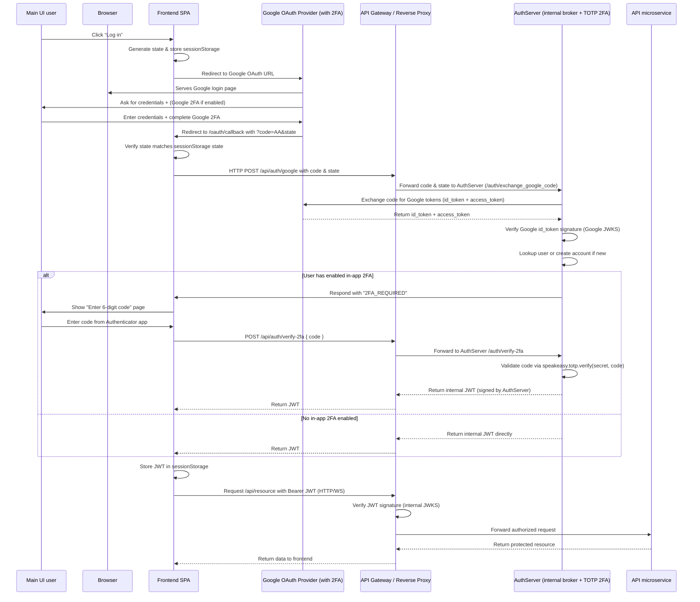

## Product purpose
SPA (single page application) that would use ws (websockets) to talk securely to backend services.
Backend is designed with microservices approach.
Key features and objectives:
* Divide the backend into smaller, loosely-coupled microservices, each responsible for specific functions or features.
* Define clear boundaries and interfaces between microservices to enable independent development, deployment, and scaling.
* Implement communication mechanisms between microservices (RESTful APIs) to facilitate data exchange and coordination.
* Ensure that each microservice is responsible for a single, well-defined task or business capability, promoting maintainability and scalability.
Implement a decent system’s architecture by adopting a microservices design approach, enabling greater flexibility, scalability, and maintainability of the backend components.

## Cybersecurity considerations
SPA is designed to enhance the security posture of the product, focuses on robust protection through Two-Factor authentication (2FA), and JSON Web Tokens (JWT), SQL injection & XSS attack mitigation collectively ensuring the products commitment to data protection, privacy, and authentication security. This SPA is GDPR comliant.

## Nginx reverse proxy (ingress in Kubernetes)
A "proxy" is a server that acts on behalf of client on a network. It serves to create one entrypoint to the internet for a network. A "reverse proxy" then does the opposite: it bundles the requests to a server in a single entrypoint. The point of a reverse proxy is to hide all the backend servers, by only connecting them to the outside world, not to route.

Pros:
* Ideal for static content.
* Very performant.
* Can easily handle SSL/TLS and caching of information.

## Api gateway - a "smart" reverse proxy, specifically for API's
An API Gateway is specifically made to handle microservices, in contrary to a reverse proxy. You can customize routing, build middleware, do authentication and authorization, etc.

Pros:
* More useful for custom, dynamic web apps and APIs, because you can define your own routing logic.
* This is used for routing to microservices, based on the API endpoint. Also possible to add sophisticated rules. Just more granular in general.
* Good for advanced authentication. With a reverse proxy, you are stuck with the internal functionality of nginx.
* Good for logging and metrics, because it's more custom and reverse proxies don't support logging tools out of the box.


## These 2 ways are investigated to get 2FA using OAuth

1. PKCE process flow
PKCE process flow is used in case SPA would need to talk securely to OAuth provider. Ensures that if someone intercepts the authorization code (retireves the code Google responds with), then with it they cannot request from Google a token, since they cannot present a verifier, that SPA stores in sessionStorage. PKCE is useful auth process flow in case you need you need to verify a public party (public source code) like a web application. So SPA created the challenge hashing a random number (verifier). Hash works one way only. SPA sends the challenge and method to Google, who keeps it until the code (temp token) lifetime and once SPA sends the code with the verifier, then Google uses the method to hash the verifier and compares to challenge. If there is a match then token is returned to SPA.

    When is PCKE process broken? In case someone can listen in on your callback URL passed code and has:
    * A. a malicious browser extension or injected JS (XSS) or browser history access that enables to access to sessionStorage where the verifier is kept and it its the first request since one verifier is allowed per authorization by Google or
    * B. abilty to send their own challenge and verifier. Then the attacker could get the token from Google. Other vulnerabilities are loss of control to callback (let say redirect URI DNS rules are not updated by domain owner, once a cloud ip changes), and in case an attacker controls the OAuth client registration. Google code is sent code encrypted in transit TLS but not in browser.

    Also woth pointing that TLS is a protection against man-in-the-middle-attack.

2. Server side secret
Prior PKCE the OAuth was done on the server side, so the Auth server in backend is the callback point for OAuth. Risks to cover here:
    * A. OAuth client registration/read control (Google console access), since it displays/registers callback location and secret.
    * B. secrets inside .env + .gitignore, not in Docker images.
Since we do not have to rely on SPA authentication and have a proxied backend, we do not have to rely on PKCE. The key is that server takes control of the second request to OAuth provider and exchanges the token itself.
I will describe the process with this diagram, using this as a basis : Login OAuth source https://auth0.com/docs/get-started/authentication-and-authorization-flow/authorization-code-flow-with-pkce
Sequence diagram for server side auth.



## HTTPS considerations for a single page application
* make vite run on https, self-signed certification. ```sudo apt install mkcert``` and  ```mkcert -key-file localhost-key-rsa.pem -cert-file localhost.pem localhost``` to get the cert and private key. this makes vite run a https web server, now the frontend container is a TLS server, so resposible for encrypting traffic to browser and decrypt traffic from browser.
- Browser uses the .pem just to authenticate the server and set up a temp session key. Server prooves that I have the private key. Once the session key is generated on both sides, all http requests and responses between the browser and frontend are encypted with it.
* CA certification process, domain owner passes a challenge e.g puts a file on on a specific location on the domain. CA creates a cert for your domain .pem inlcudes servers public key and signes it with its own private key. 
* CA cert usage. Server sends a CA signed cert string to browser, who verifies it with CA public key and concludes the connection is secure.

All credit to the team:

[](https://github.com/kantog)
[](https://github.com/STROBOLKOP)
[](https://github.com/kobe-vb)
